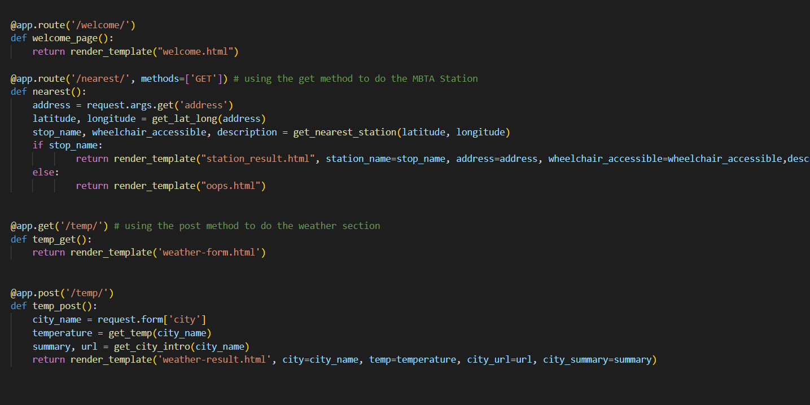
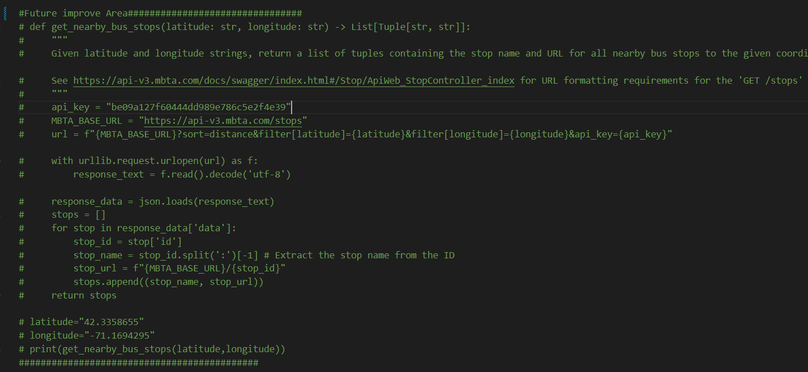
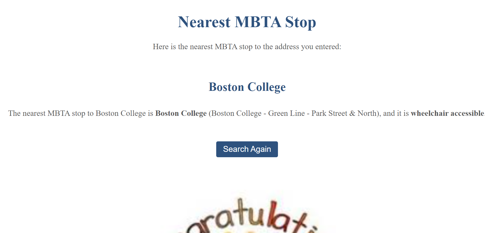

# WebApp-MBTA
**Project Overview**
In this web-app project, I created a website using Flask that allows users to find the nearest MBTA station by entering a place name. The project is divided into two parts: working on the functions in `mbta_helper.py` and creating the ''app.py'' file to display the results of the output from the function on a webpage.The `mbta_helper.py` file mainly consists of functions that are used in the '`app.py`' file and helps to connect APIs from different websites to find the nearest MBTA station. Besides, I have also included a package of Wikipidia to bring a brief introduction to the city that user searched for temperature. On the other hand, the 'app.py' file is responsible for displaying the result of the output from the functions in the '`mbta_helper.py`' file on a website.To find the latitude and longitude of the place name, I used the API key of Geomap, and to find the nearest MBTA station, I sent the latitude and longitude through the MBTA API key. I also used HTML templates to improve the UI of the webpage and included both methods of "Get" and "`post`" to retrieve and send information between web pages.

**Reflection**
I will split the Reflection part into three paragraphs: difficulties, innovations and wow factor, and how ChatGPT helps me during the learning process.

**Difficulties**
Throughout the project, I encountered several difficulties that cost me a lot of time to solve. One of the major difficulties was understanding the "Get" and "`post`" methods, which I needed to read extra materials to understand. At first, I was not consistent with the "Get" and "`post`" methods in the HTML document and 'app.py' file. I was thinking that we could get the information from the welcome page and `post` the result from the station result. However, I wrote two `post`s, which caused errors.

Eventually, I figured out a solution to use both pages. However, I still find it challenging to understand the concept of the "Get" and "`post`" methods. I finally understood the difference between them through Professor Li’s demo and the explanation in the class. The "`post`" method sends the data to the server in the request body, which is typically encrypted. It does not expose the data in the URL, making it more secure. On the other hand, the "Get" method is used to retrieve the resource that was stored in the URL. The query parameters are appended to the URL, and the data is visible in the URL. In other words, if we want to send longer and more secure data to the server, we would prefer to use "`post`," but if we are using a similar approach like searching the information from Google, we could use the "Get" method.

Another difficulty was including the information of the bus lines or stations in the search welcome page. However, I found out that most of the bus lines or stations are represented by an ID in the dictionary, which provided no more information or detailed description of the MBTA station. Additionally, I encountered a problem when switching between the bus and the MBTA station. I tried to use a radio to create a button for both options, but I had a problem redirecting the page, and I had coding problems with the bus section. Due to time constraints, I may continue to improve this section in the future.

**Innovations and Wow Factor**
I included both the "Get" and "`post`" methods in my project, with the "Get" method retrieving the information for the MBTA station and the "`post`" method retrieving the information on the weather. I also decorated my HTML template by myself, changing the font, color, background, and writing text descriptions. With assistance from ChatGPT, I adjusted the alignment and design of the UI of the webpage. Additionally, I downloaded the Wikipedia package from Python to introduce a brief summary of the city searched and included the Wikipedia URL of the city in the weather result page. Overall I really enjoyed the innovation process and I have learned a lot of knowledge on HTML script and found interest in designing UI for the web page

**Using Chatgpt**

Since I am on my own for this assignment, I do not have a teamwork dividing process. During this project, I use chatgpt mainly as a debugging tool in the '``mbta_helper.py``' and let chatgpt help me adjust some of the UI design for the HTML page. Chatgpt served as a good instructor for me to help me find the answer to the problem while I face difficulties during the project. Overall, I am satisfied with the result I achieved in this project and I feel I am much more confident about solving the problem when I faced an unexpected error during the programming process. Lastly, I feel I am excited about the upcoming final project to apply what I have studied so far on it.

